# Personalized Learning Platform


"MentorSpace" is a mentorship matching platform where users can create an account, set up a profile as a mentor or mentee, specify their skills or areas of interest, and find matches with others for mentorship opportunities.

   

---

## Key Features

- **Personalized Dashboard**: Based on profile information, mentors and mentees receive personalized dashboards..
- **Onboarding**: Following the signup process, mentors and mentees access dedicated onboarding pages to submit their profile information and set their profile images.
- **Showcasing potential mentors to mentees**: Mentees can view mentor profiles and *Make Connection Requests*.
- **Filtering**: Mentees can filter mentors based on parameters such as *Expertise, Availability, Rating*.
- **Establishing Sessions**: Mentors can schedule sessions for connected mentees on selected dates and times, providing links to meetings.
- **Sharing Resources**: Mentees can request resources from connected mentors, who can then share the requested materials.
- **Dynamic Updates**: All mentor and mentee activities are saved in Supabase SQL relations and storage, with updates dynamically reflected on dashboards.
- **Feedback System**: Mentees can provide feedback to mentors after sessions or appointments, which mentors can view on the Analytics page for personal improvement.


---

## Project Owner
   ### Sujal Soni
   

Sujal Soni is a final-year Computer Science Engineering student at Medi-Caps University with a passion for full-stack web development. With hands-on experience in modern technologies like React.js, Next.js, Node.js, MongoDB, and Firebase, Sujal has consistently demonstrated his ability to create scalable and user-centric web applications 🌐.

He has successfully delivered impactful projects, such as EventSphere, a dynamic event management platform, and EstateVerse, a real estate app focused on special offers. His technical expertise extends to implementing secure payment gateways using Razorpay and leveraging Google Cloud services like Firebase Authentication, Firestore, and Google Places API for enhanced functionality and seamless user experiences 🧑🏻‍💻

Sujal’s professional journey includes internships at NotesEra and Indo-Tech, where he contributed to building robust front-end and full-stack solutions, optimizing performance, and enhancing user engagement. Beyond his technical skills, Sujal has been an active contributor to the open-source community as a GDSC Open Source Mentor and Hacktoberfest Top Contributor 🗒️

With strong communication, teamwork, and management skills, Sujal excels in collaborative environments and thrives on tackling challenges with innovative solutions. His forward-thinking mindset and dedication to learning make him a valuable asset to any team.

---

## Tech Stack

- **Frontend**: [Next.js](https://nextjs.org/) - A React framework for building fast, scalable web applications.
- **Backend & Database**: [Supabase and PostgreSQL](https://supabase.com/) - PostgreSQL database for real-time data storage and retrieval.
- **Authentication**: [Supabase Authentication](https://supabase.com/docs/guides/auth) - Signup and Signin using supabase Authentication.
- **Styling and Responsiveness**: [Tailwind CSS](https://tailwindcss.com/) - For dynamic styling and implementing responsiveness of pages across different views (Laptop, Tablet, Smartphone).

---

## Screenshots

### Home
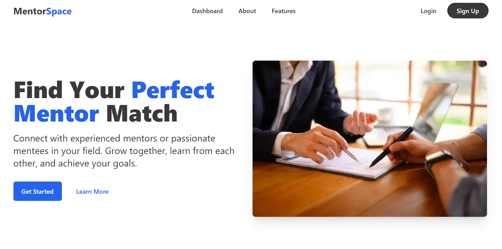
<br/>
<br/>

### Onboarding
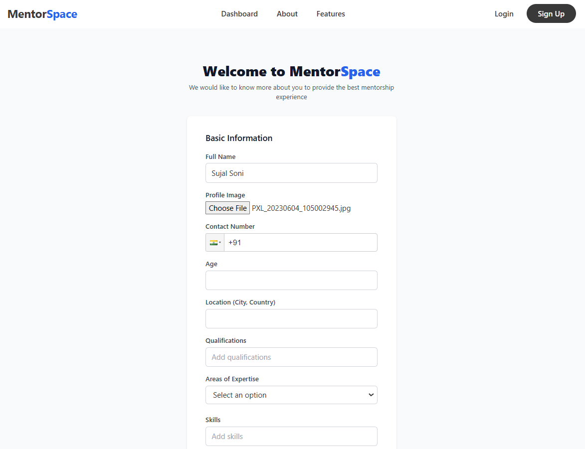
<br/>
<br/>

### Mentor Dashboard
#### 1. Mentor Home
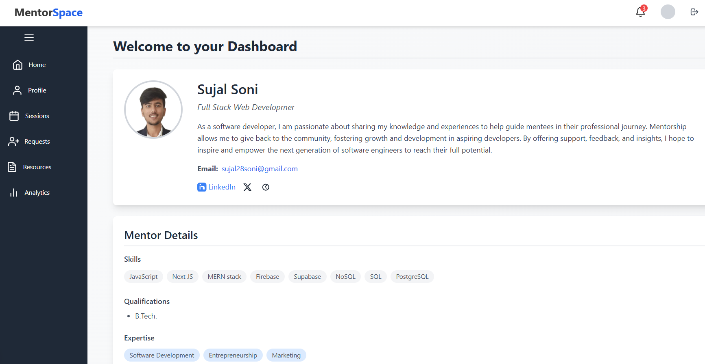
<br/>

#### 2. Mentor Sessions
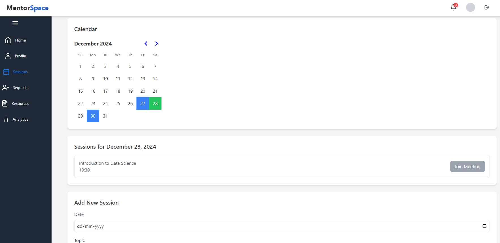
<br/>

#### 3. Mentor Requests
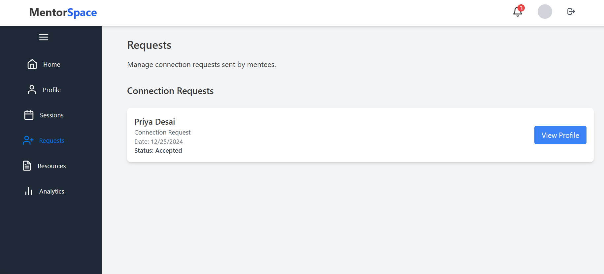
<br/>

#### 4. Mentor Resources
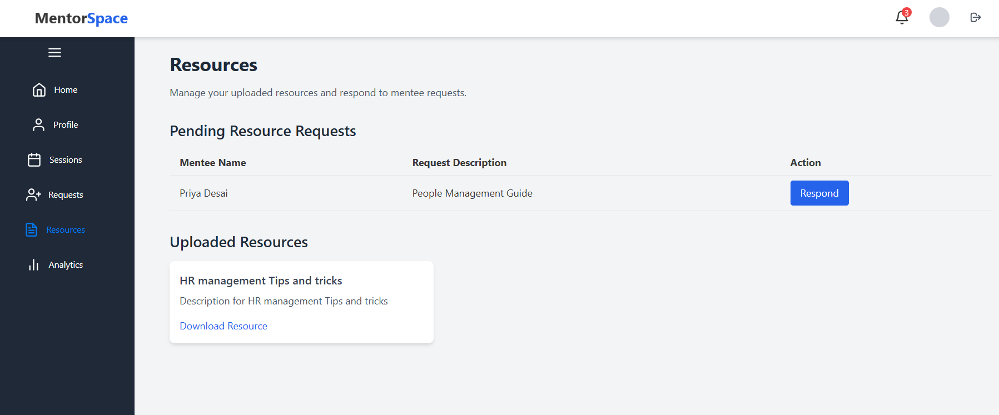
<br/>
<br/>

### Mentee Dashboard
#### 1. Mentee Home
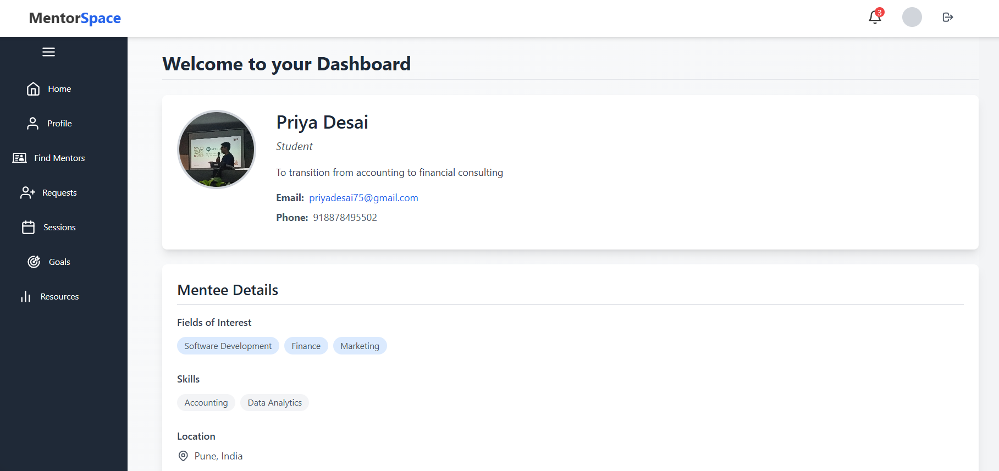
<br/>

#### 2. Explore Mentors
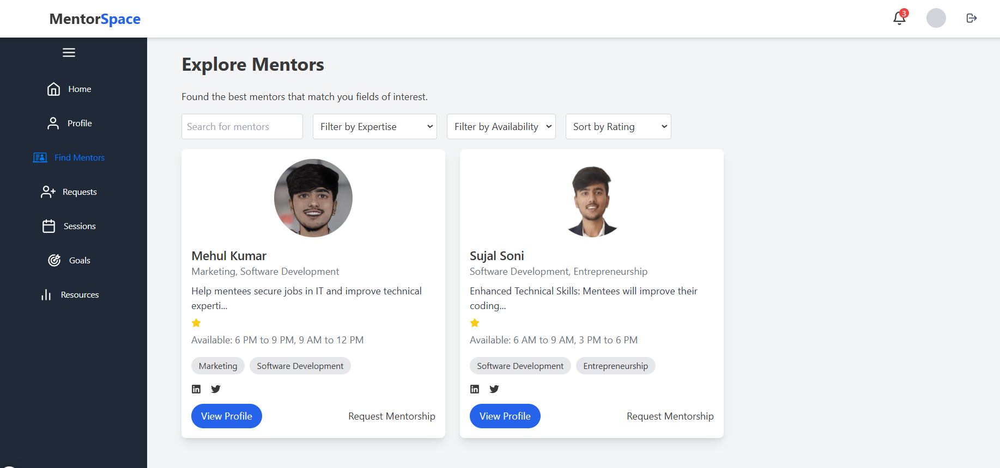
<br/>

#### 3. Mentee Requests
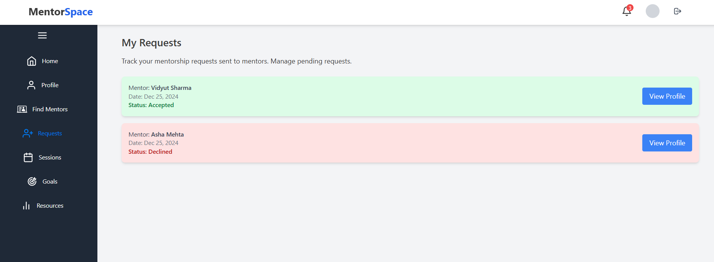
<br/>

#### 4. Mentee Sessions
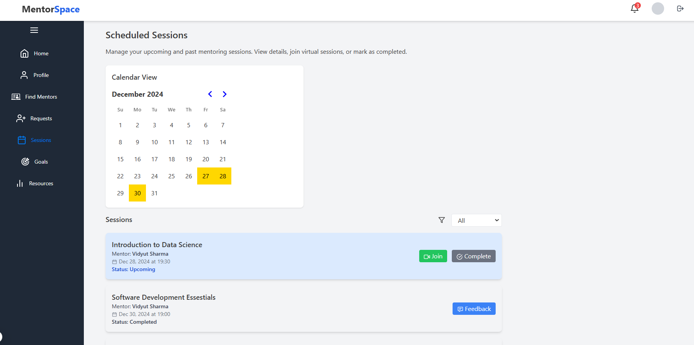
<br/>

#### 5. Mentee Resources
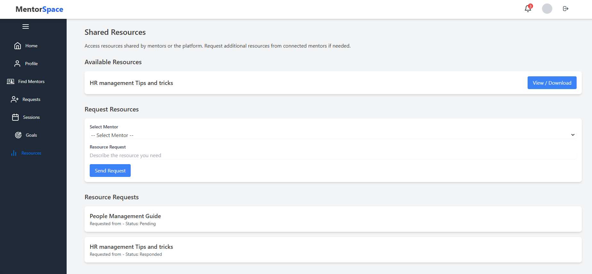
<br/>
<br/>

---

## Project Structure
   ```
   /src/
      ├── app/
      │   ├── components/
      │   │   ├── home/
      │   │   │   ├── Features.js
      │   │   │   ├── Footer.js
      │   │   │   └── Navbar.js
      │   │   └── ThemeProvider.js
      │   ├── globals.css
      │   ├── layout.js
      │   ├── menteeDashboard/
      │   │   └── [userId]/
      │   │       ├── components/
      │   │       │   ├── Navbar.js
      │   │       │   └── Sidebar.js
      │   │       ├── layout.js
      │   │       ├── MenteeDashboardContext.js
      │   │       ├── page.js
      │   │       └── screens/
      │   │           ├── Explore/
      │   │           │   └── page.js
      │   │           ├── FullProfile/
      │   │           │   └── page.js
      │   │           ├── Goals/
      │   │           │   └── page.js
      │   │           ├── Profile/
      │   │           │   └── page.js
      │   │           ├── Requests/
      │   │           │   └── page.js
      │   │           ├── Resources/
      │   │           │   └── page.js
      │   │           └── Sessions/
      │   │               └── page.js
      │   ├── menteeOnboarding/
      │   │   └── page.js
      │   ├── mentorDashboard/
      │   │   └── [userId]/
      │   │       ├── components/
      │   │       │   ├── Navbar.js
      │   │       │   └── Sidebar.js
      │   │       ├── layout.js
      │   │       ├── MentorDashboardContext.js
      │   │       ├── page.js
      │   │       └── screens/
      │   │           ├── Analytics/
      │   │           │   └── page.js
      │   │           ├── FullProfile/
      │   │           │   └── page.js
      │   │           ├── Profile/
      │   │           │   └── page.js
      │   │           ├── Requests/
      │   │           │   └── page.js
      │   │           ├── Resources/
      │   │           │   └── page.js
      │   │           └── Sessions/
      │   │               └── page.js
      │   ├── mentorOnboarding/
      │   │   └── page.js
      │   ├── page.js
      │   ├── signin/
      │   │   └── page.js
      │   ├── signup/
      │   │   └── page.js
      │   └── utils/
      │       └── middleware.js
      └── lib/
          ├── supabase-client.js
          └── utils.js

   ```

### Inside src folder:
   - components/: Contains reusable React components.
   - page.js/: This project uses App Router of Next JS to arrange each page code inside page.js file.
   - styles/: globals.css file to define global colors and styling for the project.
   - utils/: Utility functions such as "Supabase Connectivity".

---

### Contact
Reach out to the developer **Sujal Soni** 🧑🏻‍💻

Email: sujalsoni.gdsc@gmail.com
<br/>
GitHub: https://github.com/Sujal-2820
<br/>
LinkedIn: https://www.linkedin.com/in/sujal-soni/
